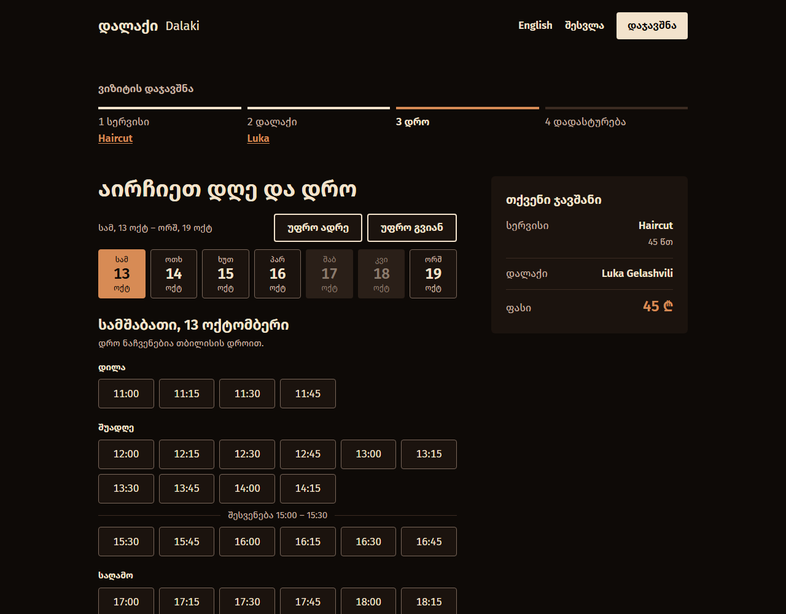
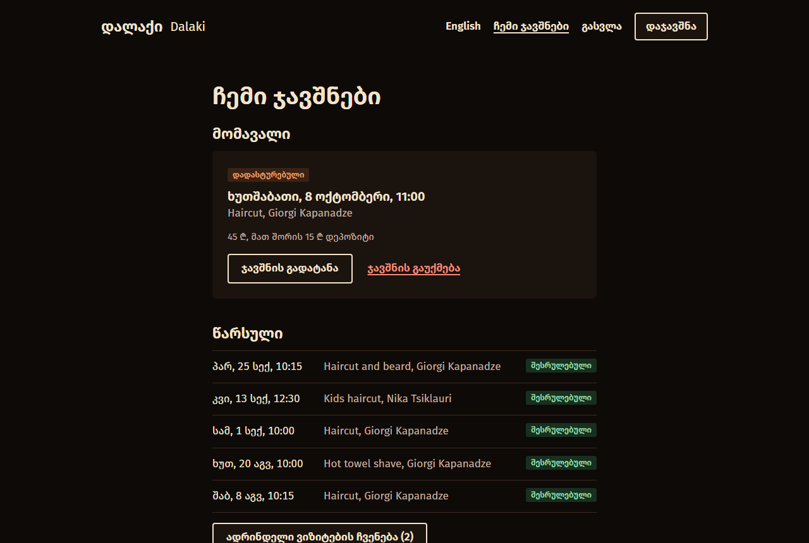
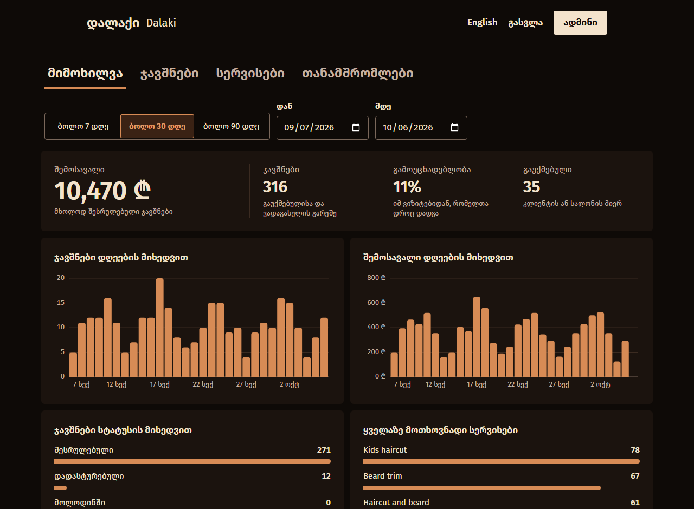
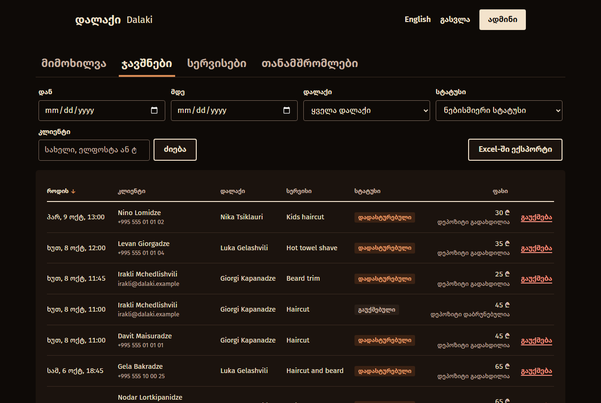

[English](README.md) · ქართული

# დალაქი, ბარბერშოპის დაჯავშნის სისტემა

დალაქი არის დაჯავშნის სისტემა რამდენიმე დალაქიანი ბარბერშოპისთვის,
აგებული თბილისში მდებარე გამოგონილი სალონის გარშემო. კლიენტი ირჩევს
სერვისს, დალაქსა და დროს, იხდის დეპოზიტს და შემდეგ შეუძლია ჯავშნის
გადატანა ან გაუქმება. თითოეულ დალაქს აქვს ტელეფონისთვის გაკეთებული
განრიგი, მფლობელს კი პანელი სერვისების, თანამშრომლების, სამუშაო
საათების, ჯავშნებისა და შემოსავლისთვის. საიტი ინგლისურ და ქართულ ენებზეა.
ეს პორტფოლიო პროექტია: ის თქვენს კომპიუტერზე ეშვება Docker-ითა და
Node-ით, არსად არ არის განთავსებული, რეალურ ფულს არ მოძრაობს და
რეალურ წერილებს არ აგზავნის.

## ეკრანები

ყველა გადაღებულია დემო მონაცემებით, რომლებსაც `npm run db:seed` ტვირთავს.
ინგლისური ვერსიის ეკრანები [ინგლისურ README-შია](README.md).

| მთავარი | დროის არჩევა |
| --- | --- |
|  |  |

| ჩემი ჯავშნები | ადმინი: მიმოხილვა |
| --- | --- |
|  |  |

| ადმინი: ჯავშნები | დალაქის გვერდი ტელეფონზე |
| --- | --- |
|  |  |

## შესაძლებლობები

კლიენტი

- დაჯავშნა ოთხ ნაბიჯად: სერვისი, დალაქი, დღე და დრო, დადასტურება.
  არჩევანი URL-ში ინახება, ამიტომ გზად შესვლა ან რეგისტრაცია იმავე
  ნაბიჯზე აბრუნებს.
- სთავაზობს მხოლოდ ნამდვილად თავისუფალ დროებს: დალაქის სამუშაო საათებში,
  შესვენებისა და დასვენების დღეების გარეთ, მინიმუმ ერთი საათით და
  მაქსიმუმ 60 დღით ადრე.
- დადასტურებისთვის დეპოზიტის გადახდა. გადაუხდელი ჯავშანი დროს 30 წუთით
  იკავებს და მანამდე „ჩემი ჯავშნებიდან“ გადახდა შესაძლებელია.
- ჩემი ჯავშნები: ჯავშნის გადატანა ან გაუქმება. გაუქმება უფასოა ვიზიტამდე
  24 საათით ადრე; ამის შემდეგ დეპოზიტი რჩება სალონს.
- წერილები: დადასტურება, გადატანა, გაუქმება და შეხსენება წინა დღეს.
- ინტერფეისი ინგლისურ და ქართულ ენებზე; გადამრთველი სათაურშია და არჩევანი
  ბრაუზერში ინახება.

დალაქი

- დღევანდელი ვიზიტები და მომავალი კვირა, ტელეფონისთვის დალაგებული.
- თითოეული ვიზიტის აღნიშვნა როგორც შესრულებული ან გამოუცხადებელი, და
  შემთხვევით შეხების შემდეგ შესწორება.
- დასვენების დღეების დამატება და წაშლა. დღე, რომელზეც უკვე არის ჯავშნები,
  უარყოფილია და ხელისშემშლელი ჯავშნები ჩამოთვლილია.

ადმინი

- მიმოხილვა არჩეული პერიოდისთვის: შემოსავალი, ჯავშნები, გამოუცხადებლობა,
  გაუქმებები, ჯავშნები და შემოსავალი დღეების მიხედვით, ჯავშნები სტატუსის
  მიხედვით და ყველაზე მოთხოვნადი სერვისები. თითოეულ დიაგრამას აქვს
  ცხრილის ხედიც.
- ჯავშნების ცხრილი, რომელიც სერვერზე იფილტრება, ლაგდება და გვერდებად
  იყოფა, ფილტრები კი URL-შია. ნებისმიერი ჯავშნის გაუქმება, დეპოზიტის
  დაბრუნებით ან მის გარეშე. გაფილტრული სიის Excel-ში ექსპორტი.
- სერვისები: დამატება, რედაქტირება, ფასებისა და დეპოზიტების დაყენება,
  გამორთვა.
- თანამშრომლები: დალაქის ანგარიშების დამატება, რედაქტირება, თითოეული
  კვირის დღის საათებისა და შესვენების დაყენება, გამორთვა.
- Telegram-შეტყობინება მფლობელს თითოეულ ახალ ჯავშანსა და გაუქმებაზე, და
  შეჯამება სალონის დახურვისას (იხილეთ „ცნობილი შეზღუდვები“).

## საინტერესო ინჟინერია

### ორმაგი დაჯავშნის თავიდან აცილება

შენახვამდე დროის თავისუფლების შემოწმება ვერ შეაჩერებს ორ მოთხოვნას,
რომლებიც ერთდროულად მოდის, ამიტომ წესს მონაცემთა ბაზა ახორციელებს.
`bookings` ცხრილს აქვს PostgreSQL-ის exclusion constraint: ერთი დალაქის
ორი ჯავშანი ერთმანეთს დროში ვერ გადაფარავს, გაუქმებულისა და ვადაგასულის
გარდა
([პირველი მიგრაცია](server/prisma/migrations/20261004143447_booking_no_overlap/migration.sql),
[მეორე](server/prisma/migrations/20261004183146_booking_overlap_ignores_expired/migration.sql)).
წაგებული მოთხოვნა ორიდან ერთ-ერთი გზით მარცხდება: ირღვევა შეზღუდვა, ან,
როცა ორივე ჩანაწერი ზუსტად ერთ მომენტში კეთდება, PostgreSQL აღმოაჩენს
deadlock-ს და ერთ-ერთს წყვეტს. `isSlotTakenError`
([errors.ts](server/src/bookings/errors.ts)) ორივეს ერთ პასუხად
განიხილავს, `409 SLOT_UNAVAILABLE`, და საიტი თავისუფალ დროებს თავიდან
ტვირთავს. ერთი ტესტი ერთი დროისთვის ორ მოთხოვნას ერთდროულად აგზავნის და
ელოდება ზუსტად ერთ `201`-ს, ერთ `409`-ს და ერთ ჩანაწერს.

### დროის სარტყლები და სალონის საათი

ჯავშანი UTC მომენტად ინახება. სამუშაო საათები სალონის საათით შუაღამიდან
გასული წუთებია, დასვენების დღეები კი სალონის კალენდარული თარიღები,
`SHOP_TIME_ZONE`-ით მითითებულ სარტყელში. ყოველი გადაყვანა ამ ორს შორის
ერთ მოდულზე გადის, [shop/time.ts](server/src/shop/time.ts), რომელიც
`Temporal` API-ზეა აგებული (ამიტომაა საჭირო Node 26). თავისუფალი დროები
წმინდა ფუნქციიდან მოდის, `calculateSlots`
([slots.ts](server/src/availability/slots.ts)), რომელიც მიმდინარე დროს
არგუმენტად იღებს, ამიტომ ტესტები ზაფხულის დროზე გადასვლასაც ფარავს:
09:00 რჩება 09:00-ად, როცა UTC-სგან წანაცვლება იცვლება, არარსებული საათი
გამოტოვებულია, განმეორებული კი ორჯერ არის შეთავაზებული. API თითოეულ დროს
სალონის თარიღითა და საათით აგზავნის და საიტი სწორედ მათ აჩვენებს, ამიტომ
სხვა სარტყელში მყოფი ვიზიტორიც სალონის დროს ხედავს.

### დეპოზიტები და გადახდის მდგომარეობები

დაჯავშნა ვიზიტს `pending` მდგომარეობით ინახავს, რაც დროს იკავებს, და
კლიენტს დეპოზიტის გადასახდელად აგზავნის. გადახდის პროვაიდერის webhook
მას `confirmed`-ად აქცევს. 30 წუთი გადაუხდელი რომ დარჩეს, ხდება
`expired` და დრო ისევ თავისუფალია; ეს ყოველ ჯერზე გამოიყენება, როცა
თავისუფალი დროები იკითხება, ამიტომ ფონური სამუშაოს გაშვებაზე არ არის
დამოკიდებული. webhook-ის ხელმოწერა მოთხოვნის დაუმუშავებელი ტანით
მოწმდება, და თითოეული მოვლენა ასე გამოიყენება: „განაახლე ჯავშანი, თუ ის
ჯერ კიდევ pending-ია“, ამიტომ განმეორებული მოვლენა არაფერს ცვლის.
გადახდა, რომელიც დაკავების ამოწურვისთანავე მოდის, დასტურდება, თუ დრო
ჯერ კიდევ თავისუფალია, და ბრუნდება, თუ არა. გაუქმება ჯერ ინახება და
მხოლოდ შემდეგ ბრუნდება თანხა; წარუმატებელი დაბრუნება `refund_failed`-ად
იწერება და გაუქმებას არასდროს აუქმებს. დეპოზიტის სტატუსი (გადაუხდელი,
გადახდილი, დაბრუნებული, დაბრუნება ვერ შესრულდა) ჯავშნის სტატუსისგან
ცალკეა. გადახდები ერთი ინტერფეისის უკან ზის
([provider.ts](server/src/payments/provider.ts)) ორი იმპლემენტაციით:
Stripe Checkout სატესტო რეჟიმში, როცა გასაღებებია მითითებული, სხვა
შემთხვევაში კი ყალბი პროვაიდერი საკუთარი გადახდის გვერდით, რომელსაც
დემოც და ტესტებიც იყენებს.

### Refresh ტოკენის როტაცია

შესვლა აბრუნებს 15-წუთიან access ტოკენს (JWT) და აყენებს 30-დღიან
refresh ტოკენს `httpOnly` ქუქიში; ბაზაში მხოლოდ მისი SHA-256 ჰეში ინახება.
refresh ტოკენი ერთხელ მუშაობს: მისი გამოყენება ახალს გასცემს და ძველს
აუქმებს. თუ გაუქმებული ტოკენი კვლავ წარდგება, ამ მომხმარებლის ყველა
სესია მთავრდება, რადგან ტოკენი შეიძლება მოპარული იყოს. ეს წესი ნიშნავს,
რომ საიტმა ერთდროულად ორჯერ არასდროს უნდა განაახლოს. access ტოკენი ერთი
მოდულის ცვლადში ცხოვრობს ([http.ts](client/src/api/http.ts)), `401`
იწვევს ერთ განახლებას და ერთ ხელახალ მცდელობას, ერთი ჩანართის მოთხოვნები
ერთ განახლებას იზიარებს, Web Lock კი ჩანართებს რიგრიგობით ამუშავებს.

### სამი სახის ტესტი

- API ტესტები (Vitest და supertest) Express აპს რეალურ PostgreSQL ბაზაზე
  უშვებს, რადგან ორმაგი დაჯავშნის წესი სწორედ იქ ცხოვრობს. დროების
  გამოთვლა პირდაპირ, წმინდა ფუნქციად იტესტება.
- კლიენტის unit-ტესტები (Vitest) ფარავს მოთხოვნების ფენის განახლებისა და
  ხელახალი მცდელობის ქცევას, დიაგრამების არითმეტიკას და თარიღისა და
  ფასის დამხმარე ფუნქციებს.
- End-to-end ტესტები (Playwright) საიტს Chromium-ში რეალური API-ითა და
  დემო მონაცემებით მართავს, ტელეფონის სიგანეზე (390 px), თუ ტესტს
  დესკტოპის განლაგება არ სჭირდება.

## ტექნოლოგიები

- საიტი (`client/`): React 19, Vite, TypeScript, Tailwind 4, React Router,
  TanStack Query, react-hook-form zod-ით. კომპონენტები და დიაგრამები ამ
  პროექტისთვისაა დაწერილი; UI ბიბლიოთეკა არ არის. ორი ენა საკუთარი პატარა
  ლექსიკონის მოდულით, i18n ბიბლიოთეკის გარეშე.
- API (`server/`): Node 26, Express 5, TypeScript tsx-ით, zod.
- ბაზა: PostgreSQL 17 Docker-ში, Prisma 7.
- ავტორიზაცია: JWT access ტოკენები და მბრუნავი refresh ტოკენები; როლები
  კლიენტი, დალაქი და ადმინი, სერვერზე ყოველ მოთხოვნაზე შემოწმებული.
- გადახდები: Stripe Checkout სატესტო რეჟიმში, ან ჩაშენებული ყალბი
  პროვაიდერი.
- წერილები: Nodemailer, ლოკალურად Mailpit იჭერს. მფლობელის შეტყობინებები:
  Telegraf. დაგეგმილი სამუშაოები: node-cron.
- ტესტები: Vitest, supertest, Playwright.

## ლოკალურად გაშვება

გჭირდებათ Node.js 26 ან უფრო ახალი, Docker Compose-ით (Docker Desktop
საკმარისია) და Git. ქვემოთ მოცემული ბრძანებები შემოწმებულია Windows 11-ზე
Git Bash-ში, Node 26.7-ითა და Docker 29.8-ით.

დააკლონირეთ რეპოზიტორია და მისი ძირიდან:

```sh
# .env.example-ის ნაგულისხმევი მნიშვნელობები ლოკალური გაშვებისთვის ისედაც გამოდგება.
# Windows-ის ბრძანებათა სტრიქონში: copy .env.example .env
cp .env.example .env

# PostgreSQL და Mailpit (საფოსტო ყუთი, რომელიც აპის ყველა წერილს იჭერს)
docker compose up -d

# API-ს პაკეტები, ცხრილები, დემო მონაცემები
cd server
npm install
npm run db:migrate
npm run db:seed

# საიტის პაკეტები
cd ../client
npm install
```

შემდეგ გაუშვით ორი ნაწილი, თითოეული საკუთარ ტერმინალში:

```sh
cd server
npm run dev    # API მისამართზე http://localhost:3000
```

```sh
cd client
npm run dev    # საიტი მისამართზე http://localhost:5173
```

გახსენით http://localhost:5173. წერილები ჩანს მისამართზე
http://localhost:8025. Stripe-ის გასაღებების გარეშე დეპოზიტი იხდება
გვერდზე, რომელსაც API ემსახურება და რომელიც ყალბადაა მონიშნული.

თუ რომელიმე პორტი დაკავებულია, შეცვალეთ `POSTGRES_PORT` (და პორტი
`DATABASE_URL`-ში), `SMTP_PORT`, `MAILPIT_UI_PORT` ან `PORT` `.env`-ში.
საიტისთვის გაუშვით `npm run dev -- --port 5274` და `APP_URL` იმავე
მისამართზე დააყენეთ.

`docker compose down` კონტეინერებს აჩერებს; `docker compose down -v`
ბაზასაც შლის.

### დემო ანგარიშები

ყველას პაროლია `demo-password`, თუ `.env`-ში `SEED_PASSWORD` მონაცემების
ჩატვირთვამდე არ შეგიცვლიათ.

| როლი     | სახელი               | ელფოსტა               | რას ხედავთ                                             |
| -------- | -------------------- | --------------------- | ------------------------------------------------------ |
| ადმინი   | თამარ ბერიძე         | tamar@dalaki.example  | პანელი მისამართზე `/admin`                             |
| დალაქი   | გიორგი კაპანაძე      | giorgi@dalaki.example | განრიგი მისამართზე `/barber`; მუშაობს სამშაბათიდან შაბათამდე |
| დალაქი   | ლუკა გელაშვილი       | luka@dalaki.example   | განრიგი მისამართზე `/barber`; მუშაობს ორშაბათიდან პარასკევამდე |
| დალაქი   | ნიკა წიკლაური        | nika@dalaki.example   | განრიგი მისამართზე `/barber`; მუშაობს ხუთშაბათიდან კვირამდე |
| კლიენტი  | დავით მაისურაძე      | davit@dalaki.example  | მუდმივი კლიენტი: მომავალი ჯავშანი და ბევრი წარსული ვიზიტი |
| კლიენტი  | ნინო ლომიძე          | nino@dalaki.example   | ჩემი ჯავშნები                                          |
| კლიენტი  | ირაკლი მჭედლიშვილი   | irakli@dalaki.example | ჩემი ჯავშნები                                          |

დემო მონაცემები კიდევ 244 კლიენტსა და თორმეტი კვირის წარსულ ჯავშნებს
ქმნის, რომ ადმინის დიაგრამებსა და ცხრილებს საჩვენებელი ჰქონდეთ. სალონი,
მისი მისამართი და ტელეფონის ნომერი გამოგონილია. ფასები ლარშია. დემო
მონაცემებში სახელები ლათინური ასოებითაა (Tamar Beridze და ა. შ.), ამიტომ
საიტი ქართულადაც ასე აჩვენებს.

## ტესტები

თითოეულ კომპლექტს მხოლოდ გაშვებული კონტეინერები სჭირდება
(`docker compose up -d`). არცერთი არ ეხება სამუშაო ბაზას.

```sh
cd server
npm test
```

API ტესტები. პირველ გაშვებაზე თავად ქმნიან და მიგრირებენ საკუთარ
`barbershop_test` ბაზას. ფარავენ რეგისტრაციას, შესვლასა და refresh
ტოკენის როტაციას; როლებს; დროების წესებს, მათ შორის შესვენებებს,
დასვენების დღეებსა და ზაფხულის დროს; დაჯავშნას, გაუქმებასა და გადატანას,
მათ შორის ერთი დროისთვის ორ ერთდროულ მოთხოვნას; გადახდებსა და webhook-ს;
წერილებს, მფლობელის შეტყობინებებსა და დაგეგმილ სამუშაოებს; დალაქის
endpoint-ებს; და ადმინის სტატისტიკას, ფილტრებსა და Excel-ექსპორტს.

```sh
cd client
npm test
```

Unit-ტესტები საიტის მოთხოვნების ფენისთვის (ტოკენი მეხსიერებაშია, `401`-ის
შემდეგ ერთი განახლება და ერთი ხელახალი მცდელობა), დიაგრამების
არითმეტიკისა და თარიღისა და ფასის დამხმარე ფუნქციებისთვის. არც ბრაუზერი,
არც ბაზა.

```sh
cd e2e
npm install
npm run browsers   # ერთხელ: ჩამოტვირთავს Chromium-ს, რომელსაც Playwright მართავს
npm test
```

End-to-end ტესტები. `npm test` თავად ტვირთავს საკუთარ `barbershop_e2e`
ბაზას, უშვებს საკუთარ API-ს 3100 პორტზე და საიტს 5174 პორტზე, ასრულებს
ტესტებს და აჩერებს მათ, ამიტომ მისი გაშვება თქვენი dev სერვერების
მუშაობისასაც შეიძლება. ტესტები ვიზიტორის სახელით ჯავშნიან და გზად
რეგისტრირდებიან, იხდიან დეპოზიტს, ტოვებენ გადახდის გვერდს და მოგვიანებით
იხდიან, ბოლო წამს დაკავებული დროის შემთხვევას უმკლავდებიან, ჯავშანს
გადააქვთ და აუქმებენ, გადატვირთვის შემდეგ შესული რჩებიან, დალაქის
სახელით შედეგს აღნიშნავენ და დასვენების დღეებს მართავენ, ადმინის
მიმოხილვას, სერვისს, ჯავშნებსა და დალაქის საათებს გადიან, და საიტს
ქართულად გადართავენ. ისინი 390 px სიგანეზე ეშვება; ადმინის ცხრილის ტესტი
1280 px-ზე, ერთი ტესტი კი ამოწმებს, რომ 320 px-ზე არაფერი არ გადადის
გვერდით.

## ცნობილი შეზღუდვები

- მხოლოდ ლოკალურად ეშვება. არაფერი არ არის განთავსებული ან დატვირთვაზე
  ტესტირებული.
- Stripe: კოდი შემოწმებულია Stripe-ის ოფიციალური API mock-ით და მისი
  ხელმოწერის შემოწმება დატესტილია, მაგრამ რეალურ Stripe ანგარიშზე
  არასდროს გაშვებულა. ტესტები და დემო ყალბ პროვაიდერს იყენებს.
- Telegram: მფლობელის შეტყობინებები Telegram-ამდე არასდროს მისულა. ბოტის
  ტოკენის გარეშე ისინი სერვერის ლოგში იწერება და ტესტები სწორედ ამ
  შემცვლელს ფარავს.
- წარუმატებელ დაბრუნებას ხელახალი მცდელობის ღილაკი არ აქვს. ჯავშანი ადმინის
  ცხრილში „დაბრუნება ვერ შესრულდა“-ს აჩვენებს და თანხა ხელით უნდა
  დაბრუნდეს.
- დასვენების დღის დამატება ამოწმებს, რომ თარიღზე ჯავშნები არ არის, და
  შემდეგ ინახავს. ამ ორს შორის მომენტში გაკეთებული ჯავშანი შეიძლება
  დასვენების დღეზე აღმოჩნდეს.
- დალაქის საათების შეცვლა ან დალაქის გამორთვა უკვე გაკეთებულ ჯავშნებს არ
  გადაწევს. ისინი ხელით უნდა გადაიტანოთ ან გააუქმოთ.
- ჯავშნის გადატანისას დალაქი და სერვისი იგივე რჩება.
- ადმინს არ შეუძლია დალაქის პაროლის ჩამოყრა ან ელფოსტის შეცვლა.
- წერილები და მფლობელის შეტყობინებები მოთხოვნის დროს იგზავნება. ნელი
  საფოსტო სერვერი დაჯავშნას ანელებს, წარუმატებელი შეტყობინება კი ლოგში
  იწერება და არ მეორდება. საწარმოო ვერსია მათ რიგში გადასცემდა.
- წარუმატებელი შეხსენება ყოველ გაშვებაზე თავიდან იცდება, ესკალაციის
  გარეშე, თუ საფოსტო სერვერი გამორთული რჩება.
- წერილები მხოლოდ Mailpit-ში შემოწმდა, რეალურ Gmail-ში, Outlook-სა და
  Apple Mail-ში არა. მათში ქართულ ლოგოტიპს მკითხველის საკუთარი ფონტი
  ხატავს, რადგან საფოსტო პროგრამები ვებ-ფონტებს არ ტვირთავს.
- წერილები მხოლოდ ინგლისურადაა, ისევე როგორც API-დან მომავალი მონაცემები
  (სერვისების სახელები, ბიოგრაფიები, შეცდომის ტექსტები) და სერვერის
  შეცდომები; საიტის ქართული ენა მხოლოდ ინტერფეისს ფარავს.
- ქართული ტექსტი დაწერილია Claude-ის მიერ და მშობლიურ ენაზე მოლაპარაკეს
  არ გადაუხედავს.
- ფონტები დაახლოებით 680 KB-ია: Literata ინგლისური ტექსტისთვის და
  FiraGO-ს ორი წონა, რომელიც ქართული ინტერფეისის, ლოგოტიპისა და ლარის
  ნიშნისთვისაა შენარჩუნებული, რადგან Literata-ს არცერთი არ აქვს. FiraGO-ს
  პაკეტი ანბანების მიხედვით ვერ იყოფა.
- ფოტოები სხვა ბარბერშოპების სტოკ-ფოტოებია Pexels-იდან და Unsplash-იდან,
  არა თბილისური სალონის.

## მეტი დეტალი

[docs/reference.md](docs/reference.md) (ინგლისურად) შეიცავს ყველა
endpoint-ს, სტატისტიკის გამოთვლის წესს, ჯავშნის მდგომარეობების სრულ
ცხრილს, Stripe-ის სატესტო რეჟიმისა და Telegram-შეტყობინებების ჩართვის
ინსტრუქციას, დაგეგმილ სამუშაოებსა და ფაილების რუკას.

## ლიცენზია

[MIT](LICENSE).
