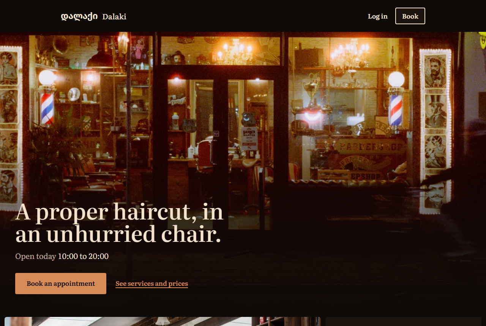
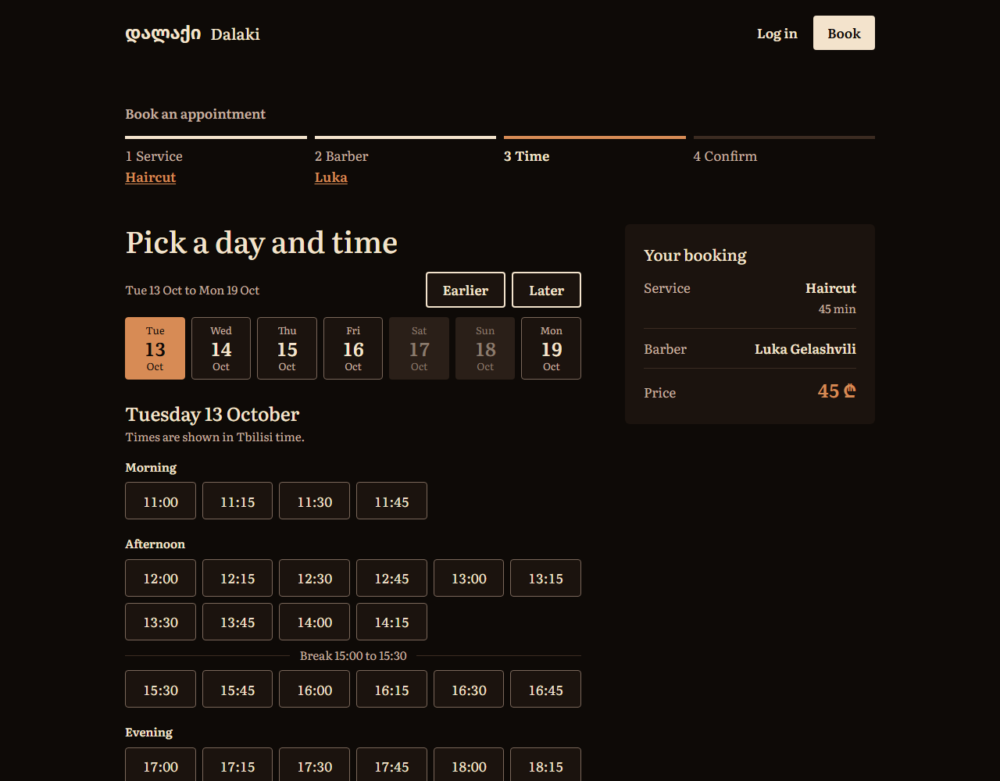
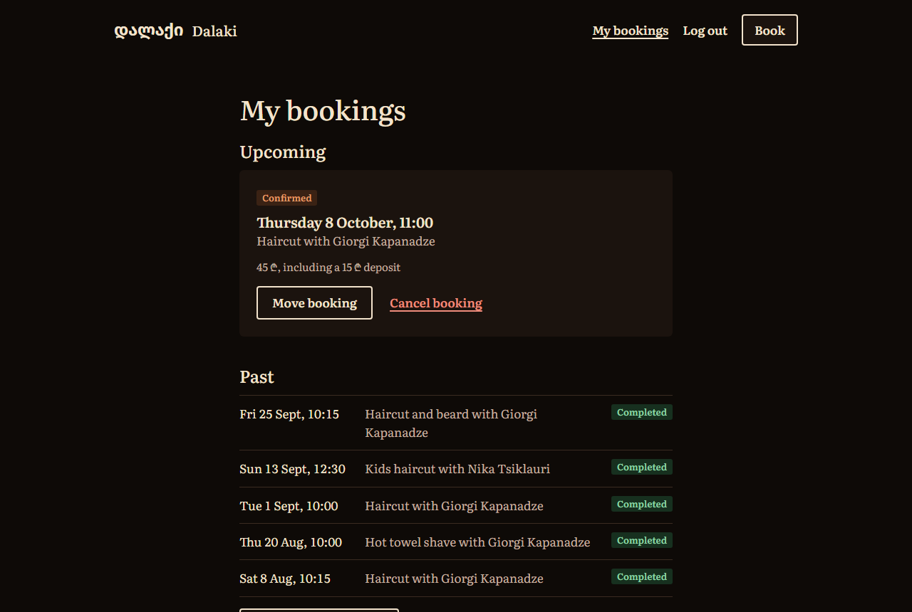
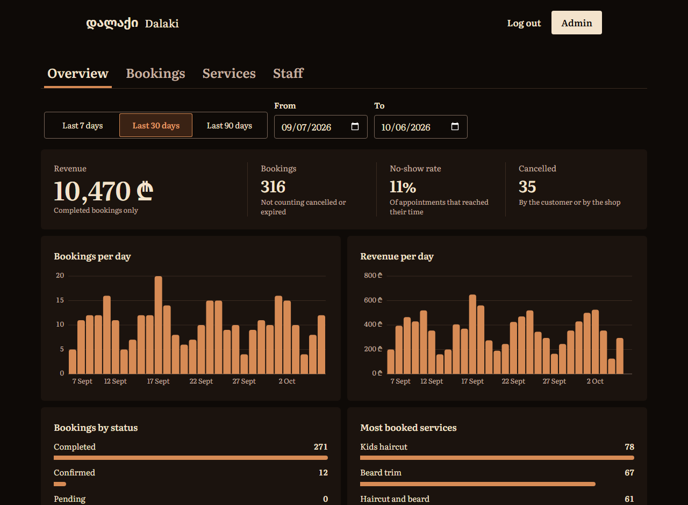
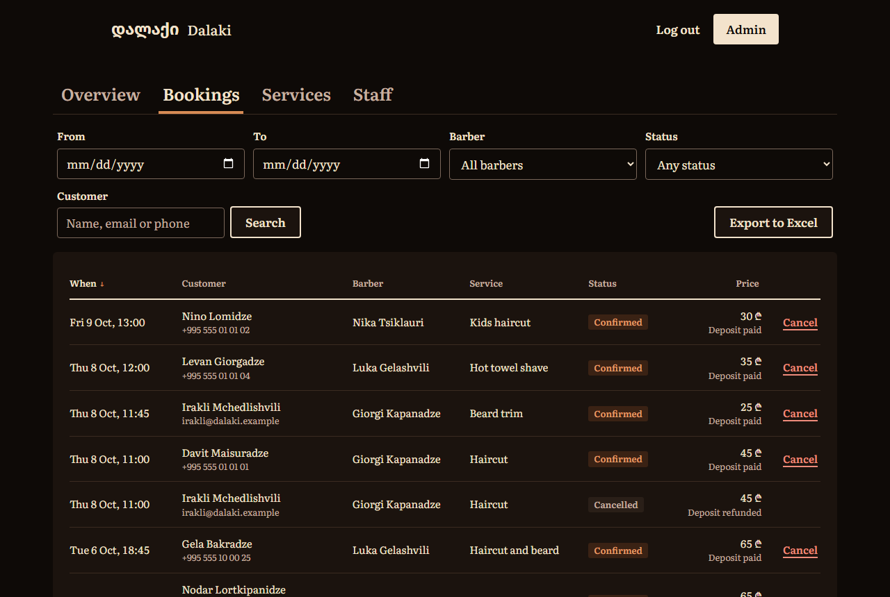
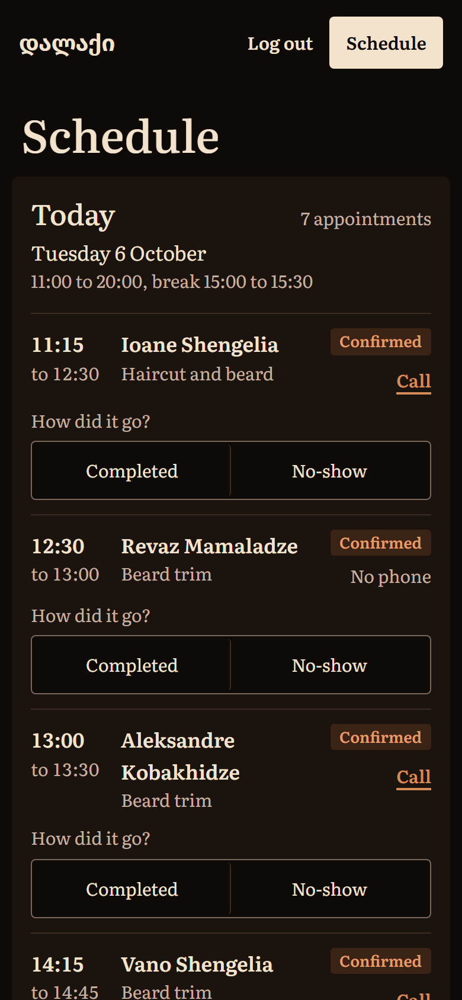

# Dalaki, a barbershop booking system

Dalaki (დალაქი, "barber" in Georgian) is a booking system for a
barbershop with several barbers, built around a fictional shop in
Tbilisi. A customer picks a service, a barber and a time, pays a deposit,
and can move or cancel the booking later. Each barber has a schedule made
for a phone, and the owner has a dashboard for services, staff, working
hours, bookings and revenue. It is a portfolio project: it runs on your
own machine with Docker and Node, is not deployed anywhere, and moves no
real money and delivers no real email.

## Screenshots

All taken from the demo data that `npm run db:seed` loads.

| Home | Picking a time |
| --- | --- |
|  |  |

| My bookings | Admin: overview |
| --- | --- |
|  |  |

| Admin: bookings | The barber's page on a phone |
| --- | --- |
|  |  |

## Features

Customer

- Book in four steps: service, barber, day and time, confirm. The choices
  are kept in the URL, so logging in or registering on the way returns to
  the same step.
- Only times that are really free are offered: inside the barber's
  working hours, outside the break and days off, at least an hour ahead
  and at most 60 days ahead.
- Pay a deposit to confirm. An unpaid booking holds its time for 30
  minutes and can be paid from My bookings until then.
- My bookings: move or cancel a booking. Cancelling is free until 24
  hours before the start; after that the deposit is kept.
- Emails: confirmation, moved, cancelled, and a reminder the day before.

Barber

- Today's appointments and the week ahead, laid out for a phone.
- Record each appointment as completed or no-show, and correct it after
  a mis-tap.
- Add and remove days off. A day that already has bookings is refused,
  and the bookings in the way are listed.

Admin

- Overview for a chosen period: revenue, bookings, no-show rate,
  cancellations, bookings and revenue per day, bookings by status, and
  the most booked services. Each chart also has a table view.
- Bookings table filtered, sorted and paged on the server, with the
  filters in the URL. Cancel any booking, with or without a refund.
  Export the filtered list to Excel.
- Services: add, edit, set prices and deposits, deactivate.
- Staff: add barber accounts, edit them, set each weekday's hours and
  break, deactivate.
- A Telegram message to the owner for each new booking and cancellation,
  and a summary at closing time (see Known limitations).

## The interesting engineering

### Preventing double bookings

Checking that a time is free before saving can't stop two requests that
arrive together, so the rule is enforced by the database. The `bookings`
table has a PostgreSQL exclusion constraint: for one barber, no two
bookings may cover overlapping time, not counting cancelled and expired
ones
([first migration](server/prisma/migrations/20261004143447_booking_no_overlap/migration.sql),
[second](server/prisma/migrations/20261004183146_booking_overlap_ignores_expired/migration.sql)).
The request that loses a race fails in one of two ways: the constraint
is violated, or, when both inserts happen at the same instant, PostgreSQL
detects a deadlock and aborts one of them. `isSlotTakenError`
([errors.ts](server/src/bookings/errors.ts)) treats both as the same
answer, `409 SLOT_UNAVAILABLE`, and the website then reloads the free
times. A test sends two requests for one slot at the same time and
expects exactly one `201`, one `409` and one row.

### Time zones and the shop clock

A booking is stored as a UTC instant. Working hours are minutes after
midnight on the shop's clock, and days off are shop calendar dates, in
the zone set by `SHOP_TIME_ZONE`. Every conversion between the two goes
through one module, [shop/time.ts](server/src/shop/time.ts), built on
the `Temporal` API (the reason for Node 26). Free times come from a pure
function, `calculateSlots`
([slots.ts](server/src/availability/slots.ts)), which takes the current
time as an argument, so the tests can cover daylight saving: 09:00 stays
09:00 when the UTC offset changes, the hour that doesn't exist is
skipped, and the hour that repeats is offered twice. The API sends each
time with the shop's own date and clock, and the website shows those, so
a visitor in another time zone still sees shop time.

### Deposits and the payment states

Booking saves the appointment as `pending`, which holds the time, and
sends the customer to pay the deposit. The payment provider's webhook
makes it `confirmed`. After 30 minutes unpaid it becomes `expired` and
the time is free again; that is applied whenever free times are read, so
it doesn't depend on a background job having run. The webhook's
signature is checked against the raw request body, and each event is
applied as "update the booking if it is still pending", so a repeated
event changes nothing. A payment that arrives just after the hold ran
out is confirmed if the time is still free and refunded if it isn't. A
cancellation is saved first and refunded second, and a refund that fails
is recorded as `refund_failed` and never undoes the cancellation. The
deposit's status (unpaid, paid, refunded, refund failed) is kept apart
from the booking's. Payments sit behind one interface
([provider.ts](server/src/payments/provider.ts)) with two
implementations: Stripe Checkout in test mode when keys are set, and
otherwise a fake provider with its own payment page, which is what the
demo and the tests use.

### Refresh token rotation

Logging in returns a 15-minute access token (a JWT) and sets a 30-day
refresh token in an `httpOnly` cookie; the database stores only its
SHA-256 hash. A refresh token works once: using it issues a new one and
revokes the old one. If a revoked token is presented again, all of that
user's sessions are ended, because the token may have been stolen.
That rule means the website must never refresh twice at once. The access
token lives in one module's variable
([http.ts](client/src/api/http.ts)), a `401` causes one refresh and one
retry, requests in the same tab share a single refresh, and a Web Lock
makes tabs take turns.

### Three kinds of tests

- API tests (Vitest and supertest) run the Express app
  against a real PostgreSQL database, because the double-booking rule
  lives there. The slot calculation is tested directly as a pure
  function.
- Client unit tests (Vitest) cover the request layer's refresh and retry
  behaviour, the chart arithmetic, and the date and price helpers.
- End-to-end tests (Playwright) drive the website in Chromium
  against the real API with seeded data, at phone width (390 px) unless
  a test needs the desktop layout.

## Stack

- Website (`client/`): React 19, Vite, TypeScript, Tailwind 4, React
  Router, TanStack Query, react-hook-form with zod. The components and
  the charts are written for this project; there is no UI library.
- API (`server/`): Node 26, Express 5, TypeScript run with tsx, zod.
- Database: PostgreSQL 17 in Docker, Prisma 7.
- Auth: JWT access tokens and rotating refresh tokens; roles customer,
  barber and admin, checked on the server for every request.
- Payments: Stripe Checkout in test mode, or the built-in fake provider.
- Email: Nodemailer, caught locally by Mailpit. Owner alerts: Telegraf.
  Scheduled jobs: node-cron.
- Tests: Vitest, supertest, Playwright.

## Run it locally

You need Node.js 26 or newer, Docker with Compose (Docker Desktop is
enough), and Git. The commands below were checked on Windows 11 in Git
Bash with Node 26.7 and Docker 29.8.

Clone the repository, then from its root:

```sh
# The defaults in .env.example work as they are for a local run.
# In the Windows command prompt: copy .env.example .env
cp .env.example .env

# PostgreSQL, and Mailpit (an inbox that catches every email the app sends)
docker compose up -d

# The API's packages, the tables, the demo data
cd server
npm install
npm run db:migrate
npm run db:seed

# The website's packages
cd ../client
npm install
```

Then start the two parts, each in its own terminal:

```sh
cd server
npm run dev    # API on http://localhost:3000
```

```sh
cd client
npm run dev    # website on http://localhost:5173
```

Open http://localhost:5173. Emails appear at http://localhost:8025. With
no Stripe keys set, the deposit is paid on a page the API serves, which
is labelled as fake.

If a port is already in use, change `POSTGRES_PORT` (and the port in
`DATABASE_URL`), `SMTP_PORT`, `MAILPIT_UI_PORT` or `PORT` in `.env`. For
the website, run `npm run dev -- --port 5274` and set `APP_URL` to the
same address.

`docker compose down` stops the containers; `docker compose down -v`
also deletes the database.

### Demo accounts

The password for all of them is `demo-password`, unless you changed
`SEED_PASSWORD` in `.env` before seeding.

| Role     | Name                 | Email                 | What you see                                        |
| -------- | -------------------- | --------------------- | --------------------------------------------------- |
| Admin    | Tamar Beridze        | tamar@dalaki.example  | The dashboard at `/admin`                           |
| Barber   | Giorgi Kapanadze     | giorgi@dalaki.example | Schedule at `/barber`; works Tuesday to Saturday    |
| Barber   | Luka Gelashvili      | luka@dalaki.example   | Schedule at `/barber`; works Monday to Friday       |
| Barber   | Nika Tsiklauri       | nika@dalaki.example   | Schedule at `/barber`; works Thursday to Sunday     |
| Customer | Davit Maisuradze     | davit@dalaki.example  | A regular: an upcoming booking and many past visits |
| Customer | Nino Lomidze         | nino@dalaki.example   | My bookings                                         |
| Customer | Irakli Mchedlishvili | irakli@dalaki.example | My bookings                                         |

The seed also creates 244 other customers and twelve weeks of past
bookings, so the admin's charts and tables have something to show. The
shop, its address and its phone number are fictional. Prices are in
Georgian lari.

## Tests

Each suite needs only the containers running (`docker compose up -d`).
None of them touches the development database.

```sh
cd server
npm test
```

API tests. They create and migrate their own `barbershop_test` database
on the first run. They cover registration, login and refresh token
rotation; roles; the slot rules, including breaks, days off and daylight
saving; booking, cancelling and moving, including two simultaneous
requests for one slot; payments and the webhook; emails, owner alerts
and the scheduled jobs; the barber's endpoints; and the admin's
statistics, filters and Excel export.

```sh
cd client
npm test
```

Unit tests for the website's request layer (token kept in memory, one
refresh and one retry after a `401`), the chart arithmetic, and the date
and price helpers. No browser and no database.

```sh
cd e2e
npm install
npm run browsers   # once: downloads the Chromium that Playwright drives
npm test
```

End-to-end tests. `npm test` seeds its own `barbershop_e2e` database,
starts its own API on port 3100 and website on port 5174, runs, and
stops them, so it can run while your dev servers are up. The tests book
as a visitor and register on the way, pay the deposit, leave the payment
page and pay later, recover when the time is taken at the last moment,
move and cancel a booking, stay logged in across a reload, record an
outcome and manage days off as a barber, and work through the admin's
overview, a service, the bookings and a barber's hours. They run at 390
px wide; the admin's table test runs at 1280 px, and one test checks
that nothing scrolls sideways at 320 px.

## Known limitations

- It runs locally only. Nothing here has been deployed or load tested.
- Stripe: the code was checked against Stripe's official API mock and
  its signature check is tested, but it has never been run against a
  real Stripe account. The tests and the demo use the fake provider.
- Telegram: the owner's alerts have never reached Telegram. Without a
  bot token they are written to the server's log, and that stand-in is
  what the tests cover.
- A failed refund has no retry button. The booking shows "Refund failed"
  in the admin's table and the refund has to be made by hand.
- Adding a day off checks that the date has no bookings and then saves
  it. A booking made in the instant between the two can end up on a day
  off.
- Changing a barber's hours, or deactivating a barber, doesn't move the
  bookings already made. They have to be moved or cancelled by hand.
- Moving a booking keeps the same barber and service.
- The admin can't reset a barber's password or change their email.
- Emails and owner alerts are sent during the request. A slow mail
  server slows the booking down, and a message that fails is logged, not
  retried. A production version would hand them to a queue.
- A reminder that fails is tried again on each run, with no escalation
  if the mail server stays down.
- The emails were checked in Mailpit only, not in real Gmail, Outlook or
  Apple Mail. The Georgian wordmark in them is drawn by the reader's own
  font, since mail programs don't load web fonts.
- The fonts are about 680 KB: Literata for the text, plus two weights
  of FiraGO kept for the Georgian wordmark and the lari sign, which
  Literata lacks. FiraGO's package can't be split by alphabet.
- The photographs are stock photos of other barbershops, from Pexels
  and Unsplash, not of a shop in Tbilisi.

## More detail

[docs/reference.md](docs/reference.md) has every endpoint, how the
statistics are calculated, the full table of booking states, how to
switch on Stripe test mode and the Telegram alerts, the scheduled jobs,
and a map of the files.

## License

[MIT](LICENSE).
