<h1 align="center">Dalaki</h1>

<p align="center">
  A booking system for a barbershop with several barbers: customers book and pay a deposit, barbers run their day from a phone, and the owner manages the shop.
</p>

<p align="center">
  
  
  
  
  
  
  
  
</p>

<p align="center">
  <b>English</b> · <a href="README.ka.md">ქართული</a>
</p>

<p align="center">
  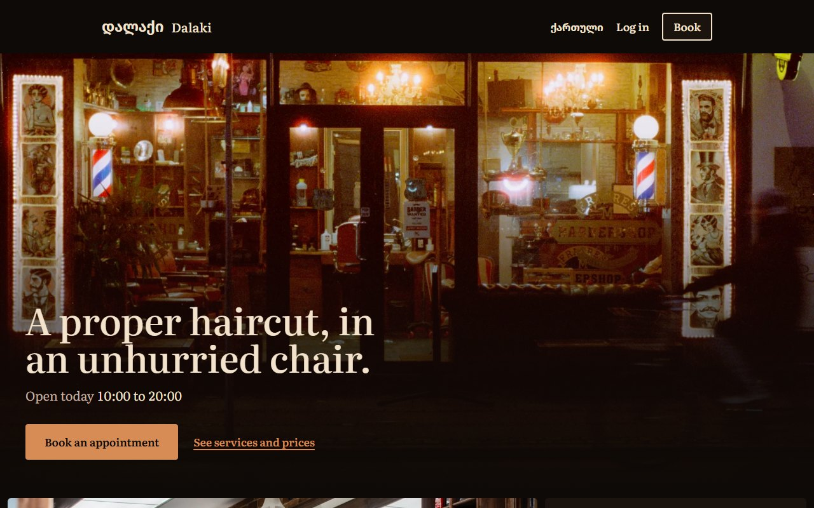
</p>

## About

Dalaki (დალაქი, "barber" in Georgian) is a web application for a barbershop in Tbilisi with three barbers. A customer picks a service, a barber and a free time, pays a deposit, and can move or cancel the booking later. Each barber has a schedule page built for a phone, where they record whether a customer came and set their own days off. The owner has an admin area for services, prices, staff, working hours, every booking, and revenue figures. The site is in English and Georgian.

I built it as a portfolio project to practise the parts of a booking system that are easy to get subtly wrong: two people booking the same slot at the same moment, working hours kept on the shop's clock while bookings are stored in UTC, a deposit that can be paid late or has to be refunded, and login sessions that survive a stolen token. I also wanted one project that goes the whole way: a schema with hand-written constraints, an API tested against a real database, a React client without a UI kit, and end-to-end tests in a browser.

> **This is a demo.** The shop is fictional and the data comes from a seed script (247 customers and twelve weeks of bookings). It runs on your own machine; it is not deployed. No real money moves and no real email is delivered: without Stripe keys a clearly labelled fake payment page stands in for the checkout, and all mail is caught by a local inbox.
>
> Not finished or not proven: the Stripe integration has only been run against Stripe's API mock, never a real account; the Telegram alerts have never reached Telegram; there is no password reset or email verification; emails are in English only. The full list is in [docs/reference.md](docs/reference.md#known-limitations).

## Contents

- [Features](#features)
- [Screenshots](#screenshots)
- [Use case diagram](#use-case-diagram)
- [Database](#database)
- [Tech stack](#tech-stack)
- [Project structure](#project-structure)
- [Setup](#setup)
- [Pages and API](#pages-and-api)
- [Security](#security)
- [Credits](#credits)
- [License](#license)

## Features

**Public site**

- See the services with their length and price, the barbers with their working days, the opening hours and the address.
- See whether the shop is open today, on the shop's clock.
- Switch the whole interface between English and Georgian; the choice is remembered.

**Booking**

- Book in four steps: service, barber, day and time, confirm. The choices live in the URL, so logging in or registering halfway returns to the same step.
- Be offered only times that are really free: inside the barber's hours, outside the break and days off, at least an hour ahead and at most 60 days ahead.
- Pay a deposit to confirm. An unpaid booking holds its time for 30 minutes and can still be paid from My bookings until then.
- Be told when a time was taken a moment earlier, and get the fresh list of times.

**Accounts**

- Register as a customer, log in, stay logged in across reloads, log out.
- Land on the page for your role after login: My bookings, the barber's schedule or the admin area.

**My bookings**

- See upcoming bookings and past visits.
- Move a booking to another time, or cancel it. Until 24 hours before the start the deposit is refunded; after that it is kept.
- Get an email when a booking is confirmed, moved or cancelled, and a reminder the day before.

**Barber**

- See today's appointments and any week, on a layout made for a phone.
- Record each appointment as completed or no-show, and correct it after a wrong tap.
- Call a customer from the list.
- Add and remove days off. A day that already has bookings is refused and the bookings in the way are listed.

**Admin**

- Read revenue, bookings, no-show rate and cancellations for any period, with charts per day or per week, bookings by status and the most booked services. Each chart also has a table view.
- Filter, sort and page through every booking; search by customer; cancel any booking with or without a refund; export the filtered list to Excel.
- Add, edit and deactivate services, with their price, deposit and length.
- Add barber accounts, edit them, set each weekday's hours and break, deactivate them.

**Behind the scenes**

- Unpaid bookings expire, reminders go out, and refresh tokens are cleaned up by scheduled jobs.
- The owner gets a message for each new booking and cancellation and a summary at closing time (written to the server log unless a Telegram bot is configured).

## Screenshots

All taken from the running app with the seeded demo data. The same screens in Georgian are in the [Georgian README](README.ka.md#ეკრანები).

| Home | Services, barbers and hours |
| --- | --- |
|  | 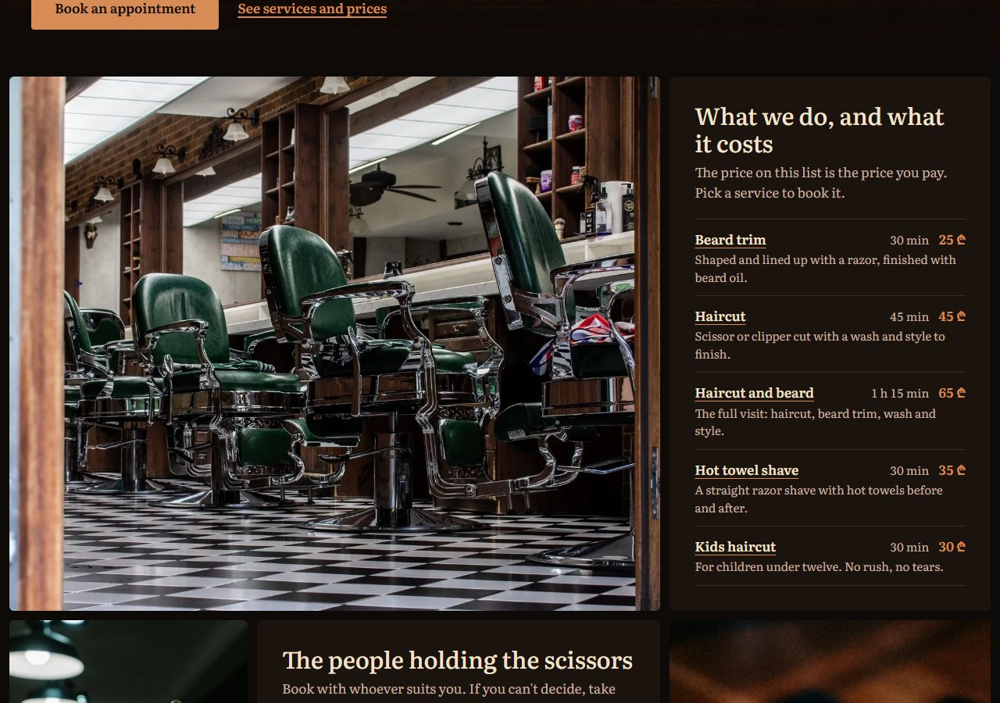 |

| 1. Choose a service | 2. Choose a barber |
| --- | --- |
| 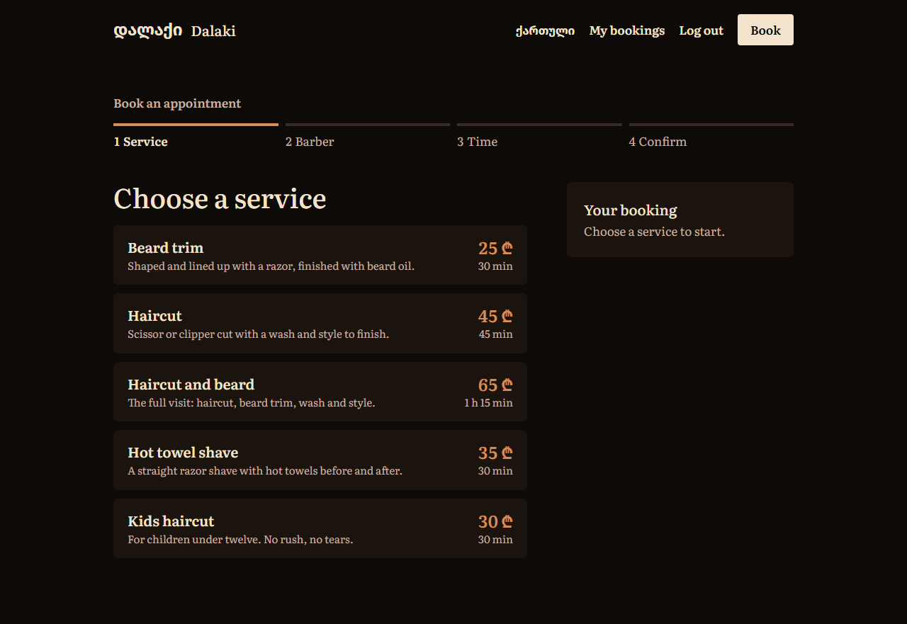 | 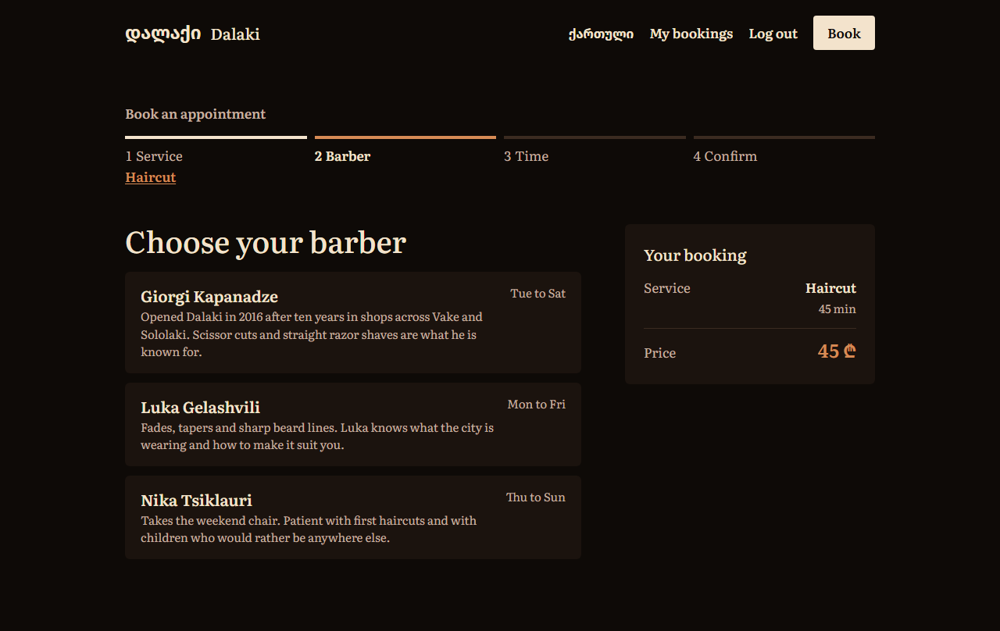 |

| 3. Pick a day and time | 4. Confirm |
| --- | --- |
| 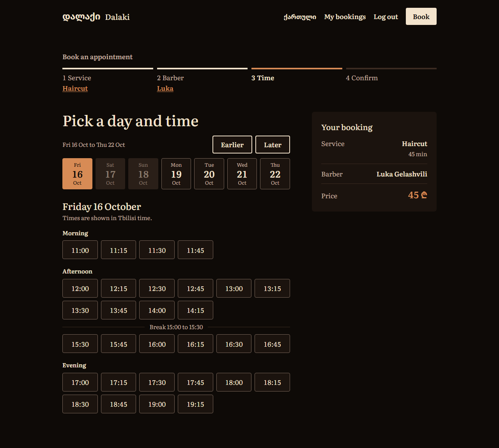 | 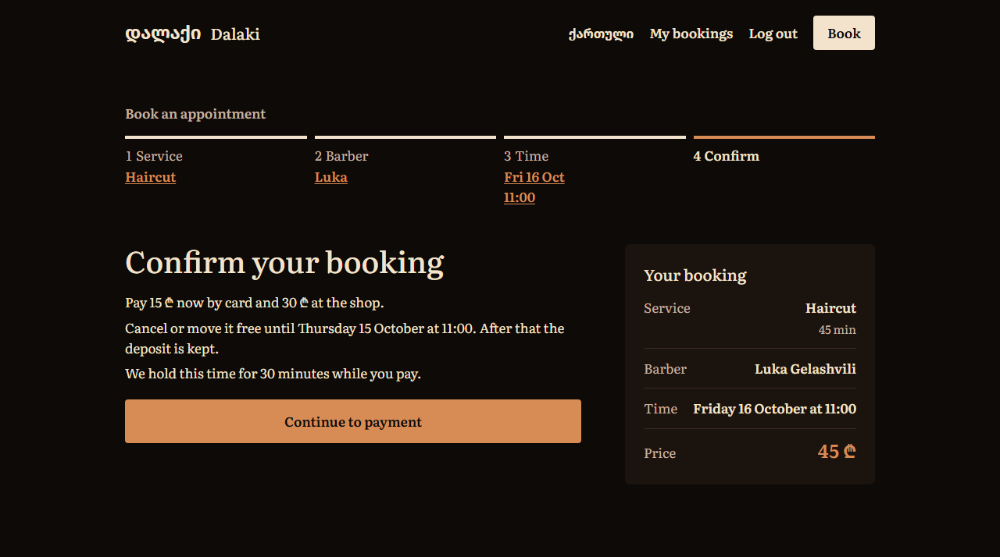 |

| Payment page (demo provider) | My bookings |
| --- | --- |
|  |  |

| Move a booking | Confirmation email |
| --- | --- |
| 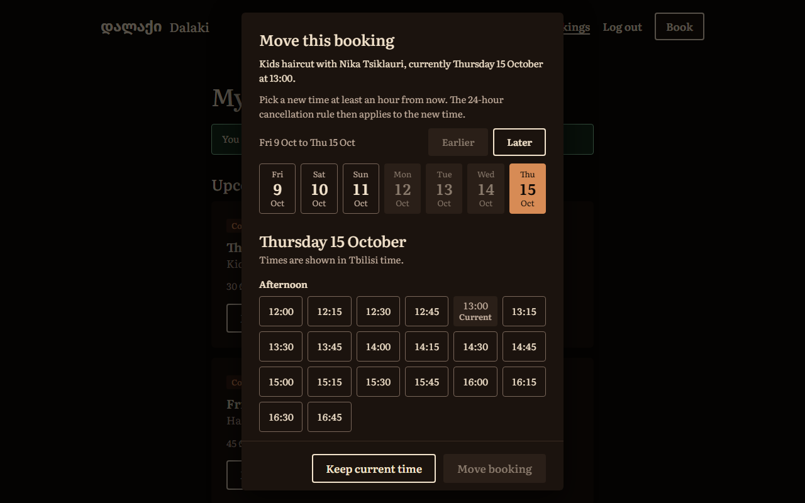 |  |

| Log in | Register |
| --- | --- |
| 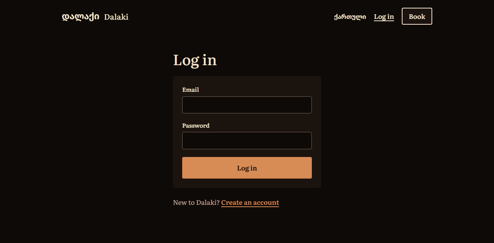 | 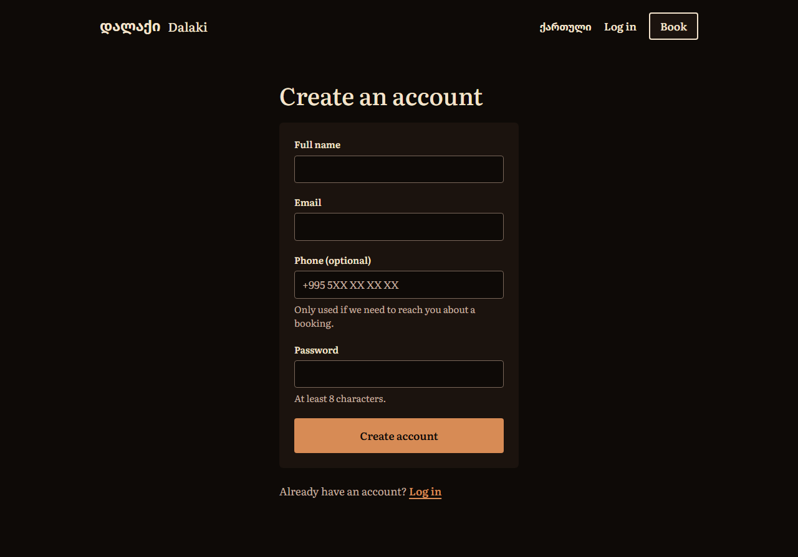 |

| Barber: schedule | Admin: overview |
| --- | --- |
| 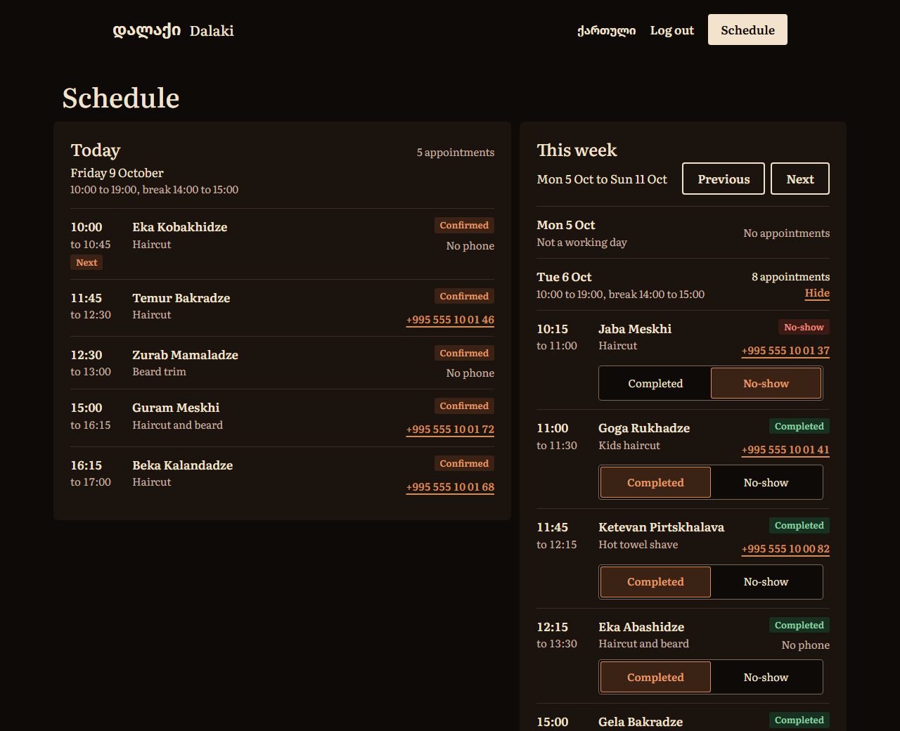 |  |

| Admin: bookings | Admin: services |
| --- | --- |
|  | 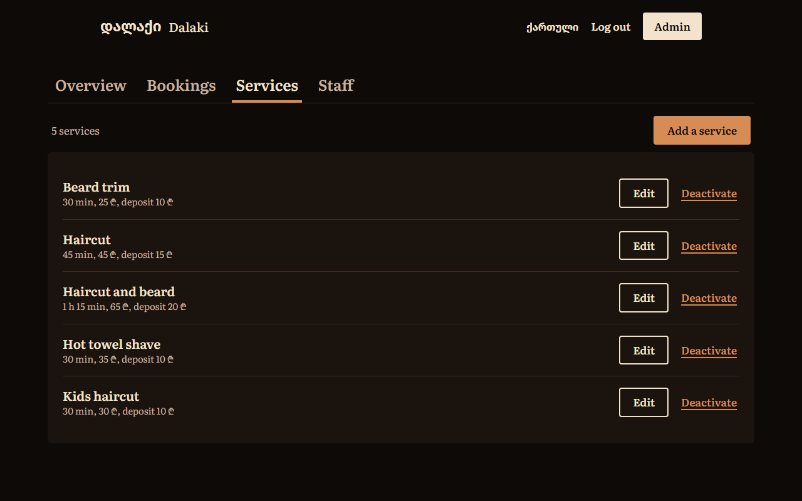 |

| Admin: staff | Admin: working hours |
| --- | --- |
| 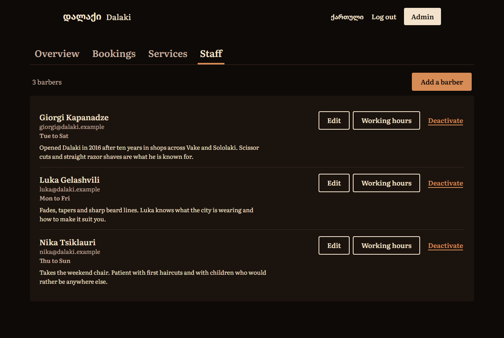 | 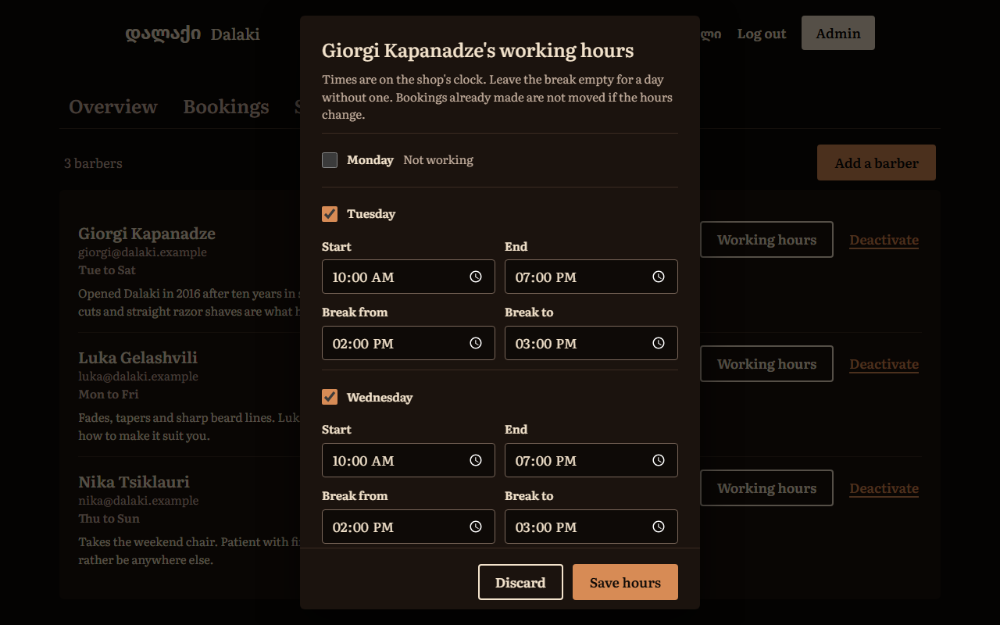 |

On a phone:

<p align="center">
  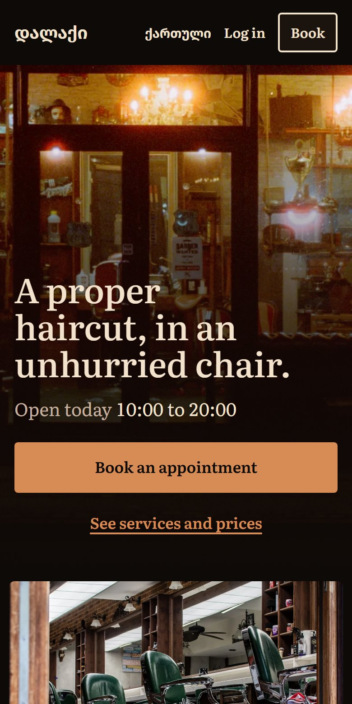
  &nbsp;&nbsp;
  
</p>

## Use case diagram

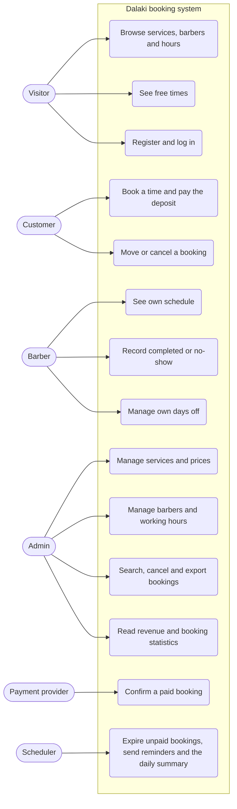

A customer can do everything a visitor can. Barbers and the admin log in with the same form as customers.

## Database

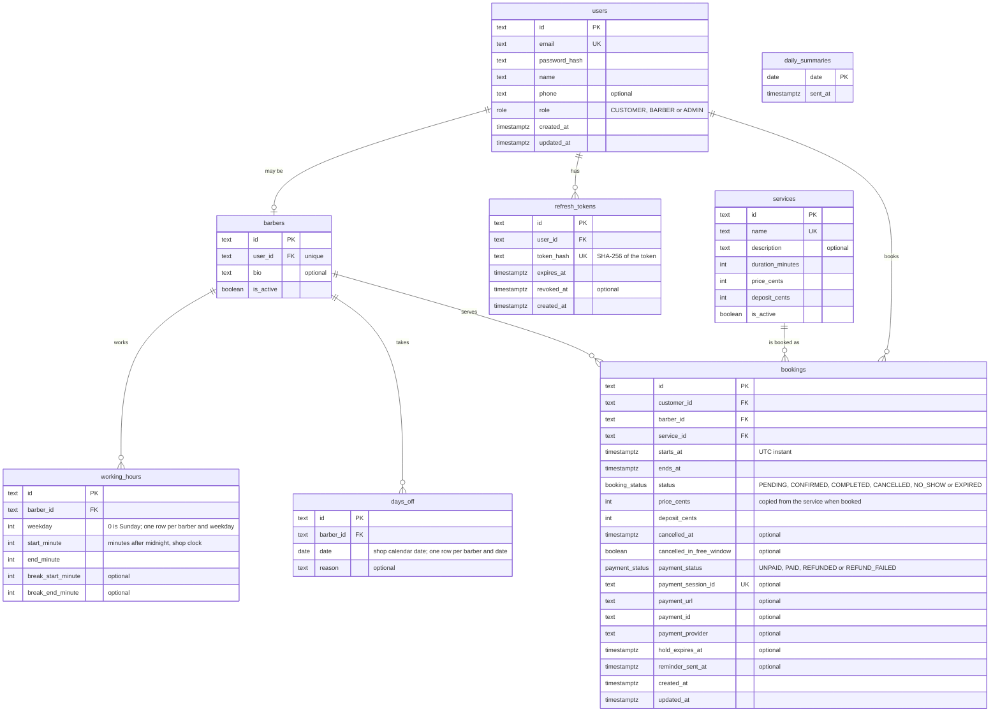

A user is a customer, or is linked to one barber row, or is the admin; a booking joins one customer, one barber and one service, and a barber has one working-hours row per weekday and any number of days off. `daily_summaries` stands alone: a row marks that the owner's summary for that date was sent. The ids are UUIDs stored as text.

One rule lives in a hand-written migration because Prisma can't express it: an exclusion constraint on `bookings` that rejects two bookings for the same barber whose times overlap, ignoring cancelled and expired ones ([first migration](server/prisma/migrations/20261004143447_booking_no_overlap/migration.sql), [second](server/prisma/migrations/20261004183146_booking_overlap_ignores_expired/migration.sql)). That is what prevents a double booking when two requests arrive together; [docs/reference.md](docs/reference.md#how-double-booking-is-prevented) explains it.

## Tech stack

| Layer | Technology |
| --- | --- |
| Language | TypeScript 7 on both sides, run on the server with tsx |
| Website | React 19, React Router 8, TanStack Query 5, react-hook-form with zod |
| Styling | Tailwind CSS 4; the components and the charts are written for this project, with no UI library |
| Build | Vite 8 |
| API | Node.js 26, Express 5, zod for validation |
| Database | PostgreSQL 17 in Docker, Prisma 7 as the ORM, hand-written SQL migrations where needed |
| Auth | JWT access tokens (jose), rotating refresh tokens in an httpOnly cookie, bcrypt password hashes |
| Payments | Stripe Checkout in test mode, or a built-in fake provider |
| Email and alerts | Nodemailer, caught locally by Mailpit; Telegraf for owner alerts |
| Scheduled jobs | node-cron |
| Excel export | write-excel-file |
| Languages | A small dictionary module of my own, no i18n library |
| Tests | Vitest and supertest for the API, Vitest for the client, Playwright for end-to-end |

## Project structure

```
.
├── .env.example                # every setting, with instructions; copied to .env
├── docker-compose.yml          # PostgreSQL and Mailpit
├── docs/
│   ├── reference.md            # how payments, auth, availability and the jobs work
│   └── screenshots/            # the images in this README (ka/ holds the Georgian ones)
├── server/                     # the API
│   ├── prisma/
│   │   ├── schema.prisma       # the data model
│   │   ├── migrations/         # SQL applied in order, two of them written by hand
│   │   └── seed.ts             # demo data: 3 barbers, 5 services, 247 customers, 12 weeks
│   ├── src/
│   │   ├── index.ts            # starts the server and the scheduled jobs
│   │   ├── app.ts              # builds the Express app and mounts the routers
│   │   ├── env.ts              # reads and validates the environment
│   │   ├── db.ts               # Prisma client, pinned to UTC
│   │   ├── errors.ts           # AppError and the one error format
│   │   ├── dependencies.ts     # payments, mailer and alerts, swappable in tests
│   │   ├── auth/               # register, login, refresh token rotation, role middleware
│   │   ├── shop/               # shop details, and all shop-clock to UTC conversion
│   │   ├── services/           # GET /services
│   │   ├── barbers/            # GET /barbers
│   │   ├── availability/       # the slot calculation (a pure function) and its route
│   │   ├── bookings/           # create, list, cancel, reschedule; the rules and statuses
│   │   ├── payments/           # provider interface, Stripe and fake providers, webhook
│   │   ├── notifications/      # email templates, mailer, owner alerts
│   │   ├── jobs/               # expiry, reminders, daily summary, token clean-up
│   │   ├── barber/             # a barber's schedule, outcomes and days off
│   │   └── admin/              # services, staff, bookings, statistics, Excel export
│   └── tests/                  # API tests, run against a real PostgreSQL database
├── client/                     # the website
│   ├── index.html
│   ├── vite.config.ts          # Vite, Tailwind, and the /api proxy to the server
│   ├── public/photos/          # the photographs on the home page
│   └── src/
│       ├── main.tsx            # providers and the router
│       ├── routes.tsx          # the route table
│       ├── index.css           # design tokens and base styles
│       ├── api/                # fetch wrapper (token, refresh, retry) and query hooks
│       ├── auth/               # session state, forms, the route guard
│       ├── i18n/               # English and Georgian dictionaries and the t() function
│       ├── components/         # Button, Input, Dialog, Tag, Segmented, Layout and others
│       ├── pages/              # home, booking, login, register, My bookings, barber
│       ├── booking/            # stepper, slot picker, summary, cancel and move dialogs
│       ├── barber/             # appointment row, day agenda, days off
│       ├── admin/              # the four admin pages, charts and their arithmetic
│       ├── lib/                # dates, formatting, form errors, safe redirects
│       └── fonts/              # Literata
└── e2e/                        # Playwright tests that drive the site in a browser
    ├── playwright.config.ts    # starts its own API and website
    ├── global-setup.ts         # migrates and seeds its own database
    └── tests/                  # booking, barber and admin flows
```

## Setup

**Requirements:** Node.js 26 or newer (the time zone code uses the built-in `Temporal`), Docker with Compose (Docker Desktop is enough), and Git. I ran the steps below from a fresh clone on Windows 11 in Git Bash, with Node 26.7 and Docker 29.8.

1. Clone the repository and go into it.

   ```sh
   git clone https://github.com/MrTabaOfficial/Barbershop-Booking-System.git
   cd Barbershop-Booking-System
   ```

2. Create the environment file. The defaults work as they are for a local run.

   ```sh
   cp .env.example .env
   ```

   In the Windows command prompt use `copy .env.example .env` instead.

3. Start PostgreSQL and Mailpit. Compose creates the `barbershop` database.

   ```sh
   docker compose up -d
   ```

4. Install the API's packages, create the tables, and load the demo data.

   ```sh
   cd server
   npm install
   npm run db:migrate
   npm run db:seed
   ```

5. Install the website's packages.

   ```sh
   cd ../client
   npm install
   ```

6. Start the API in one terminal.

   ```sh
   cd server
   npm run dev
   ```

7. Start the website in another terminal.

   ```sh
   cd client
   npm run dev
   ```

8. Open http://localhost:5173. Emails the app sends appear at http://localhost:8025.

If a port is taken, change `PORT` (the API), `POSTGRES_PORT` together with the port in `DATABASE_URL`, `SMTP_PORT` or `MAILPIT_UI_PORT` in `.env`. For the website run `npm run dev -- --port 5274` and set `APP_URL` in `.env` to the same address.

### First login

The seed creates these accounts. The password for all of them is `demo-password` (the value of `SEED_PASSWORD` in `.env`).

| Role | Name | Email | Lands on |
| --- | --- | --- | --- |
| Admin | Tamar Beridze | tamar@dalaki.example | `/admin` |
| Barber | Giorgi Kapanadze | giorgi@dalaki.example | `/barber` |
| Barber | Luka Gelashvili | luka@dalaki.example | `/barber` |
| Barber | Nika Tsiklauri | nika@dalaki.example | `/barber` |
| Customer | Davit Maisuradze | davit@dalaki.example | `/bookings`, with many past visits |
| Customer | Nino Lomidze | nino@dalaki.example | `/bookings` |
| Customer | Irakli Mchedlishvili | irakli@dalaki.example | `/bookings` |

You can also register a new customer on the site. To pay a deposit, press "Pay the deposit" on the fake payment page; no card is needed.

### Tests

Each suite needs only the containers from step 3, and none of them touches the development database.

```sh
cd server
npm test        # API tests against their own barbershop_test database
```

```sh
cd client
npm test        # unit tests, no browser and no database
```

```sh
cd e2e
npm install
npm run browsers   # once: downloads the Chromium that Playwright drives
npm test           # seeds barbershop_e2e, starts its own API and site, runs, stops them
```

To stop: `docker compose down` stops the containers, and `docker compose down -v` also deletes the database.

## Pages and API

Pages of the website:

| Path | Who | What it is |
| --- | --- | --- |
| `/` | Everyone | Home: services, barbers, hours, address |
| `/book` | Everyone; login is asked for at the last step | The four booking steps, kept in the query string |
| `/login`, `/register` | Everyone | Log in, create a customer account |
| `/bookings` | Logged in | My bookings |
| `/barber` | Barber | Schedule and days off |
| `/admin` | Admin | Overview |
| `/admin/bookings`, `/admin/services`, `/admin/staff` | Admin | The other three admin pages |

The API. In the browser every path is behind `/api`, which the Vite server forwards to the API with the prefix removed. Every error has the shape `{ "error": { "code", "message", "details" } }`.

| Method | Path | Access | Purpose |
| --- | --- | --- | --- |
| POST | `/auth/register` | Public | Create a customer account and log in |
| POST | `/auth/login` | Public, rate limited | Return an access token and set the refresh cookie |
| POST | `/auth/refresh` | Refresh cookie | Swap the refresh cookie for a new session |
| POST | `/auth/logout` | Refresh cookie | Revoke the refresh token and clear the cookie |
| GET | `/auth/me` | Logged in | The current user |
| GET | `/shop` | Public | Time zone, today's date, booking limits, address, phone |
| GET | `/services` | Public | Active services |
| GET | `/barbers` | Public | Active barbers with their hours and breaks |
| GET | `/availability` | Public | Free start times for a barber, a service and a date |
| POST | `/bookings` | Logged in | Hold a time and return the payment page's address |
| GET | `/bookings/mine` | Logged in | The caller's upcoming and past bookings |
| POST | `/bookings/:id/cancel` | Logged in, own booking | Cancel; refunds when 24 hours or more ahead |
| POST | `/bookings/:id/reschedule` | Logged in, own booking | Move a confirmed booking, until 24 hours before |
| POST | `/payments/webhook` | Payment provider, signed | Confirm or expire a booking |
| GET, POST | `/payments/fake-checkout/:sessionId` | Anyone with the link | The demo payment page and its "pay" action |
| GET | `/barber/schedule` | Barber | Days with hours, day off and bookings |
| POST | `/barber/bookings/:id/complete` | Barber, own booking | Mark as completed |
| POST | `/barber/bookings/:id/no-show` | Barber, own booking | Mark as no-show |
| GET, POST | `/barber/days-off` | Barber | List and add days off |
| DELETE | `/barber/days-off/:id` | Barber, own day off | Remove a day off |
| GET, POST | `/admin/services` | Admin | List all services, create one |
| PATCH | `/admin/services/:id` | Admin | Edit, activate or deactivate |
| GET, POST | `/admin/barbers` | Admin | List all barbers, create a barber account |
| PATCH | `/admin/barbers/:id` | Admin | Edit, activate or deactivate |
| PUT | `/admin/barbers/:id/working-hours` | Admin | Replace a barber's week of hours and breaks |
| GET | `/admin/bookings` | Admin | Filtered, sorted and paged bookings |
| GET | `/admin/bookings/export.xlsx` | Admin | The same filters, as an Excel file |
| POST | `/admin/bookings/:id/cancel` | Admin | Cancel any booking, with or without a refund |
| GET | `/admin/overview` | Admin | Statistics for a range of dates |

Query parameters and the details of each endpoint are in [docs/reference.md](docs/reference.md#api).

## Security

What the code does:

- Passwords are hashed with bcrypt (cost 10) and must be 8 to 72 characters. A login for an unknown email is checked against a dummy hash, so it takes as long as a real one.
- Access tokens are JWTs signed with HS256 that last 15 minutes. The server refuses to start if the signing secret is shorter than 32 characters.
- Refresh tokens are 32 random bytes, stored only as a SHA-256 hash, and replaced on every use. Presenting a token that was already used ends all of that user's sessions.
- The refresh cookie is `httpOnly`, `SameSite=Strict`, limited to the `/auth` path, and `Secure` when `NODE_ENV` is `production`.
- In the browser the access token is kept in a variable, never in `localStorage`.
- Failed logins are limited to 10 per 15 minutes per IP address.
- Roles are checked on the server for every request to `/barber` and `/admin`. A barber asking for another barber's booking or day off gets a 404. A `role` sent to the register endpoint is dropped.
- All request input is validated with zod. Database access goes through Prisma, and the hand-written SQL uses parameterised tagged templates.
- Double bookings are rejected by a database constraint, not only by a check in code.
- Payment webhooks are verified against the raw request body with the provider's signature, and applying the same event twice changes nothing.
- The `?next=` address after login is followed only when it is a path inside the site.
- Unexpected errors return a generic message; the detail goes to the server log.
- In Docker Compose the database and the mail inbox listen on `127.0.0.1` only.

What to change before putting it on the internet:

- Replace `POSTGRES_PASSWORD`, `JWT_ACCESS_SECRET` and `SEED_PASSWORD`, and don't load the demo accounts.
- Set `NODE_ENV=production` and serve over HTTPS, so the refresh cookie is marked `Secure`.
- Set real Stripe keys. Without them the fake payment page is active, and anyone holding its link can mark a booking as paid.
- Put a reverse proxy in front that serves the site and forwards `/api`; that proxy exists only in Vite's dev and preview servers today. Then set Express's `trust proxy`, or the login limit will count the proxy's address.
- Add security headers (for example with helmet) and a content security policy; there are none.
- Add rate limits to registration and booking; only login has one, and it is kept in memory.
- Add email verification and password reset; neither exists.

## Credits

Libraries, all installed from npm:

| Library | Used for | License |
| --- | --- | --- |
| React, React DOM, React Router | The website | MIT |
| TanStack Query | Loading and caching server data | MIT |
| react-hook-form, @hookform/resolvers | Forms | MIT |
| zod | Validation on both sides | MIT |
| Tailwind CSS, Vite, @vitejs/plugin-react | Styling and build | MIT |
| Express, cookie-parser, express-rate-limit | The API | MIT |
| Prisma (client, CLI, pg adapter) | Database access and migrations | Apache-2.0 |
| jose | Signing and verifying JWTs | MIT |
| bcryptjs | Password hashing | BSD-3-Clause |
| stripe | Stripe Checkout and webhooks | MIT |
| Nodemailer | Sending email | MIT-0 |
| Telegraf | Telegram messages | MIT |
| node-cron | Scheduled jobs | ISC |
| write-excel-file, read-excel-file | Excel export, and reading it back in tests | MIT |
| tsx, Vitest, supertest | Running and testing the server | MIT |
| Playwright | End-to-end tests | Apache-2.0 |
| TypeScript | The language | Apache-2.0 |

Fonts:

- [Literata](https://github.com/googlefonts/literata) by TypeTogether, SIL Open Font License 1.1. The files in `client/src/fonts` come from Google Fonts.
- [FiraGO](https://bboxtype.com/typefaces/FiraGO/) by bBox Type, SIL Open Font License 1.1, through the `@fontsource/firago` package. It draws the Georgian interface, the wordmark and the lari sign.

Docker images: `postgres:17-alpine` and `axllent/mailpit`.

Photographs, all free to use under the [Pexels License](https://www.pexels.com/license/) or the [Unsplash License](https://unsplash.com/license) (checked on each photo's page on 6 October 2026). They show other barbershops, not a shop in Tbilisi. I resized them to 1600 px and saved them as WebP; the shop front is also cropped at the top.

| File in `client/public/photos` | Photographer | Source |
| --- | --- | --- |
| `window-night.webp` | Mikael Buchholtz | [Pexels](https://www.pexels.com/photo/store-entrance-in-town-at-night-15445264/) |
| `interior.webp` | Wal_ | [Pexels](https://www.pexels.com/photo/vintage-barber-shop-interior-with-classic-chairs-37764947/) |
| `fade.webp` | Antoni Shkraba | [Pexels](https://www.pexels.com/photo/man-getting-a-haircut-4625626/) |
| `chair.webp` | Antoni Shkraba | [Pexels](https://www.pexels.com/photo/a-man-in-barber-shop-4625632/) |
| `barber.webp` | Antoni Shkraba | [Pexels](https://www.pexels.com/photo/man-giving-his-customer-a-haircut-4625631/) |
| `scissors.webp` | Renan Rezende | [Pexels](https://www.pexels.com/photo/barber-cutting-hair-5584458/) |
| `finished.webp` | Brian Silva | [Pexels](https://www.pexels.com/photo/barber-perfecting-a-fade-haircut-close-up-39559270/) |
| `tools.webp` | dwi rina | [Unsplash](https://unsplash.com/photos/black-framed-eyeglasses-beside-black-pen-sjjvyTFsnW8) |
| `shave.webp` | Mitchell Orr | [Unsplash](https://unsplash.com/photos/a-man-getting-his-hair-cut-by-a-barber-iDbTDUzQTxY) |
| `bulbs.webp` | Ashkan Forouzani | [Unsplash](https://unsplash.com/photos/filament-bulbs-turned-on-d0kvBZZsMMw) |

There are no icon sets or templates: the favicon and the charts are drawn in this project.

## License

[MIT](LICENSE) © 2026 MrTabaOfficial. The photographs and fonts keep their own licenses, listed above.
